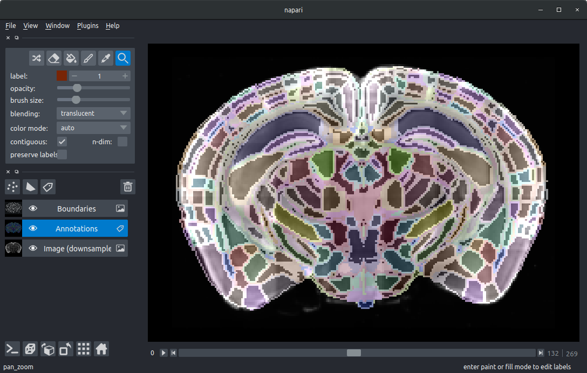

# Tutorial

To test out brainreg, we supply a small mouse brain dataset to get you started.


For full information on how to use brainreg, please see the [User guide](getting-started/)


### Instructions:

#### Setting up

* Download the data from [here](https://gin.g-node.org/cellfinder/data/raw/master/brainreg/test_brain.zip) \(the dataset is ~10MB, so it should download quickly\).
* Unzip the data to a directory of your choice \(doesn't matter where\). You should end up with a directory called `test_brain` with 270 `.tif` images
* Open a terminal \(Linux\) or your command prompt \(Windows\)
* Activate your [conda environment ](../installation/using-conda.md)

#### Run brainreg

To run brainreg, you need to know:

* Where your data is \(in this case, it's the path to the `test_brain` directory\)
* Where you want to save the output data \(we'll just save it into a directory called `brainreg_output`in the same directory as the `test_brain`\)
* The pixel sizes of your data in microns \(see [Specifying pixel size](../user-guide/usage/specifying-pixel-size.md) for details\). In this case, our data is 40um per pixel in x and y \(in the coronal plane\) and 50um in z \(the spacing of each plane\)
* Which atlas you want to use \(you can see which are available by running `brainglobe list`. In this case, we want to use a mouse atlas \(as that's what our data is\), and we'll use the 50um version of the [Allen Mouse Brain Atlas](https://mouse.brain-map.org/static/atlas). 


Normally the 50um mouse atlases are only used for testing \(the registration will work much quicker at lower resolution\). In this case, the test input data is very low resolution, so using a higher resolution atlas doesn't make much sense.   
  
When using your own data, you'll probably \(but not definitely\) find that higher resolution atlases work better. Make sure to test out the different resolutions to see what works best


To run brainreg, we put this all together in a single command:

```text
brainreg test_brain brainreg_output -x 40 -y 40 -z 50 --atlas allen_mouse_50um
```

Lots of stuff will get printed to the console as brainreg runs, and when it's done \(it should only take a minute or so\), you will see something like:

```text
INFO - MainProcess cli.py:230 - Finished. Total time taken: 0:00:29.15
```

This means that the registration is complete.

#### Visualising the results

brainreg comes with a plugin for napari \(see [Visualisation](visualisation.md)\) for easy visualisation of the results.

To view your data, run `napari` from the same terminal/command as you ran brianreg \(or open a new one and activate your conda environment\). You can then drag and drop the `brainreg_output` directory into napari, and see the results:




The results are likely not perfect because \(for speed and simplicity\) we:

* Used very low resolution data
* Used a low resolution atlas
* Left all the parameters as default \(which were optimised for higher resolution atlases\)



