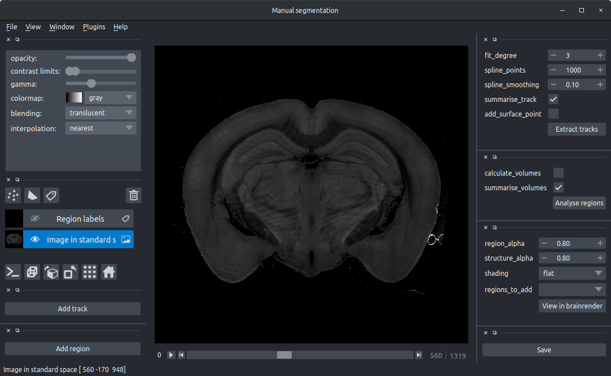

# Manually segment in standard space

To manually segment brain regions and tracks in standard space that can then be visualised along with other samples \(e.g. in [BrainRender](https://github.com/BrancoLab/BrainRender).\)

**N.B. This tool depends \(for now\) on** [**amap**](https://github.com/SainsburyWellcomeCentre/amap)**. Please run `pip install amap` and then `amap_download` before running this tool if you don't already have cellfinder installed**

### Prerequisites

Data must be registered to a standard atlas \(currently only the [Allen Reference Atlas](http://mouse.brain-map.org/) is supported\) using [amap](https://github.com/SainsburyWellcomeCentre/amap-python) \(or the amap based registration in [cellfinder](https://github.com/SainsburyWellcomeCentre/cellfinder)\). Please follow the instructions for these packages, and ensure that the channel that you want to segment is downsampled \(e.g. using the `--downsample` flag in amap\).

## Usage

### Command line

```bash
    manual_seg "name_of_downsampled_image.nii" registration_directory
```

manual\_seg will transform your image into standard space \(this may take a few minutes\) and then display the image in a [napari](https://github.com/napari/napari) viewer:



**To segment regions:**

* Click the `Add region` buttons
* If required, rename this region \(by selecting the e.g. `region_0` text\)
* Navigate to where you want to draw your region of interest.
  * Use the scroll bar at the bottom \(or left/right keys\) to navigate 

    through the image stack

  * Use the mouse scrollwheel to zoom in or out
  * Drag with the mouse the pan the view
* Choose a brush size \(top left box\)
* Make sure painting mode is activated \(by selecting the paintbrush, top left\). You can 

  go back to the navigation mode by selecting the magnifying glass.

* Colour in your region that you want to segment, ensuring that you make a 

  solid object. 

* Selecting the `ndim` toggle in the top left will extend the brush size in three dimensions \(so it will colour in multiple layers\).
* Add a new region if required \(`Add region`\)
* Repeat above for each region you wish to segment.
* Save the regions `Save` making sure that the terminal window shows that the saving has completed.
* Click `Analyse regions` to analyse the spatial distribution of the regions you have drawn. 
  * If `calculate volumes` is selected,  the volume of each brain area included in the segmented region will be calculated and saved.
  * If `summarise_volumes` is selected, then each region will be summarised \(centers, volumes etc\)

**Editing regions:**

If you have already run `manual_seg`, and run it again, the segmented regions will be shown. You can edit them, and click `Save` to resave them.

**Previewing in brainrender**

Segmented regions \(once saved\) can be previewed in brainrender in 3D. Simply click on `View in brainrender`.  There are a number of options you can change:

* `region_alpha` Transparency of the regions you have manually drawn
* `region_to_add` Optional atlas brain regions to render in addition to the manually drawn regions
* `structure alpha` Transparency of the brain regions rendered
* `shading` Shading type for the regions you have segmented, choose from `flat`, `giroud` or `phong.`

